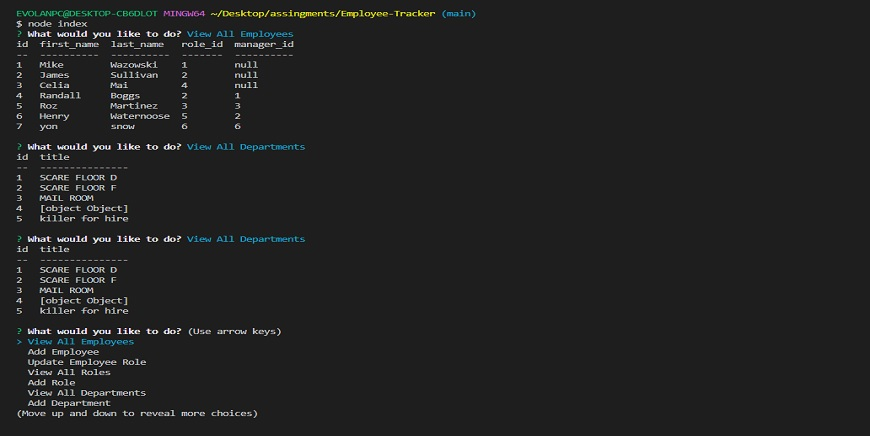

# Employee-Tracker

## Description

- This application is designed to keep record of your business personnel in a neat and easy to use way.

## Technical Skills

## Table of Contents

- [Access](#access)
- [Visuals](#visuals)
- [Credits](#credits)
- [License](#license)
- [Features](#features)
- [Roadmap](#roadmap)
- [How to Contribute](#how-to-contribute)

## Access

## Link to the Walkthrough video [**HERE**](https://www.youtube.com/watch?v=nbEXODdxJro)

## Visuals

---

---

## Credits

- Melany Pietrowski https://github.com/Melpie10 for all your constructive 
comments and infinite patience when a concept proves difficult to understand.

-The four Codesmen- (myself being one of)
- Edwin Pietrowski https://github.com/BogartDME
- Denart Ifurung https://github.com/difurung
- Charles Beatty https://github.com/beattycharles
- UNCC coding bootcamp TA's and all Ask-BCS for all their insight and help with concepts.

## License

Copyright (c) [2022] [Yonatan Yael Bermudez Diez]

## Features

- Search by Employee, Role or Department
- Update Employee's Roles.
- Add new Departments.
- Add new Roles.
- Add new Employees.

## Roadmap

- Update employee managers.
- View employees by manager.
- View employees by department.
- Delete departments, roles, and employees.
- View the total utilized budget of a department.

## How to Contribute

Constructive Comments are always welcome. e-mail me: yon_baermund@hotmail.com

(<a href="#top">Back to top</a>)

